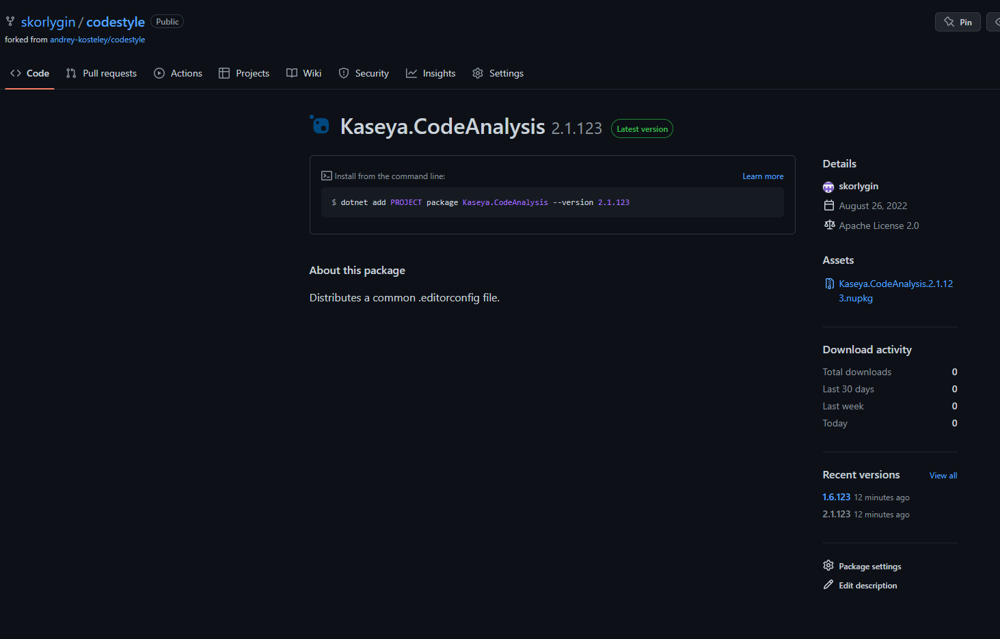

## Deploy

If you decide to publish the next version of the nuget packages, you will need to create a tag with a name like "csharp_###" and push it.
<br />Example:
```
$ git tag csharp_1
$ git push --tags
```

## Review

To analyze the style and quality of .NET code, analyzers are used that are configured using the _**.editorconfig**_ file
<br />see [Code analysis in .NET](https://docs.microsoft.com/en-us/dotnet/fundamentals/code-analysis/overview)
<br />see [EditorConfig](https://editorconfig.org/)
<br />see [Configuration files for code analysis rules - .NET](https://docs.microsoft.com/en-us/dotnet/fundamentals/code-analysis/configuration-files)

### There are several analyzer packages

[NetAnalyzers](https://docs.microsoft.com/en-us/visualstudio/code-quality/roslyn-analyzers-overview?view=vs-2022), [StyleCop](https://www.nuget.org/packages/StyleCop.Analyzers/), [Roslynator](https://www.nuget.org/packages/Roslynator.Analyzers/), [XUnit Analyzers](https://www.nuget.org/packages/xunit.analyzers/), and [Sonar Analyzer](https://www.nuget.org/packages/SonarAnalyzer.CSharp/).

### Current _.editorconfig_

Current _**.editorconfig**_ file configures two analyzer packages:
<br />Microsoft.CodeAnalysis.CSharp.CodeStyle - [Code-style rules overview - .NET](https://docs.microsoft.com/en-us/dotnet/fundamentals/code-analysis/style-rules/)
<br />StyleCop.Analyzers - [StyleCopAnalyzers Status](https://dotnetanalyzers.github.io/StyleCopAnalyzers)

## How to include _.editorconfig_

You will need to install the appropriate version of the _Kaseya.CodeAnalysis_ nuget package into your project and all the following magic should appear by itself after the first build.
<hr />
The _**.editorconfig**_ file must be placed at the root of the solution/project.
<br />Microsoft.CodeAnalysis.CSharp.CodeStyle - will work automatically in popular IDEs (Visual Studio, Visual Studio Code, Rider (partial))
<br />StyleCop.Analyzers - for this package to work, you need to include the NuGet package [StyleCop.Analyzers](https://www.nuget.org/packages/StyleCop.Analyzers/) in solution

The _**.editorconfig**_ supported by Visual Studio, Visual Studio Code, Rider (partially) and other IDEs (if it supports .editorconfig settings)
<br /><span style="color:green">Note:</span> IDEs may introduce their own additional rules, but .editorconfig has the highest priority.
<br /><span style="color:red">Attention:</span> _**.editorconfig**_  will only work at the IDE level. See below for how the analyzers work during build.

## Running analyzes at build time

* The ._**editorconfig**_ file must be placed at the root of the solution/project.
* Add NuGet packages to your projects:
  <br />[Microsoft.CodeAnalysis.CSharp.CodeStyle](https://www.nuget.org/packages/Microsoft.CodeAnalysis.CSharp.CodeStyle/)
  <br />[StyleCop.Analyzers](https://www.nuget.org/packages/StyleCop.Analyzers/)

* After that, the projects will be built taking into account the analyzers and issue errors and warnings according to the analyzers settings.

## Run in CI/CD

If NuGet packages are included in the project, the analyzers described above will be launched when the project is built
<br /><span style="color:green">Note:</span> if the NuGet packages described above are not included in the project being built, they can be installed during the build, and then the build will be carried out with the analyzers. This way we can force the analyzers to run and issue build errors.

## How it looks in github packages

When you click on the Packages link in "<>code" tab of the main repository, you see list of the packages. One of them will be a nuget package with name like "Kaseya.CodeAnalysis" and look like:

